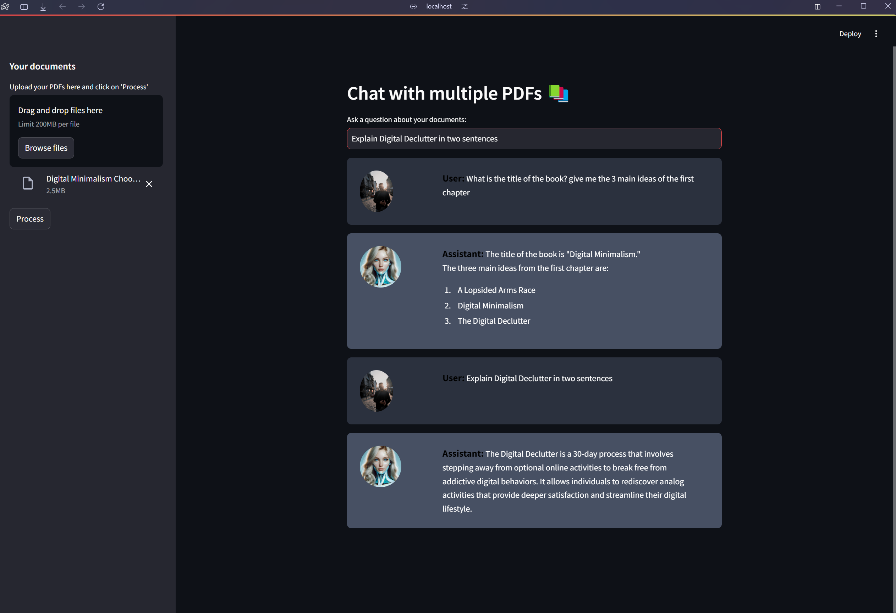

<div align="center">
<pre>
 __       __ __    __ __       ________ ______ _______  _______  ________       ______  __    __  ______  ________ 
|  \     /  \  \  |  \  \     |        \      \       \|       \|        \     /      \|  \  |  \/      \|        \
| ▓▓\   /  ▓▓ ▓▓  | ▓▓ ▓▓      \▓▓▓▓▓▓▓▓\▓▓▓▓▓▓ ▓▓▓▓▓▓▓\ ▓▓▓▓▓▓▓\ ▓▓▓▓▓▓▓▓    |  ▓▓▓▓▓▓\ ▓▓  | ▓▓  ▓▓▓▓▓▓\\▓▓▓▓▓▓▓▓
| ▓▓▓\ /  ▓▓▓ ▓▓  | ▓▓ ▓▓        | ▓▓    | ▓▓ | ▓▓__/ ▓▓ ▓▓  | ▓▓ ▓▓__        | ▓▓   \▓▓ ▓▓__| ▓▓ ▓▓__| ▓▓  | ▓▓   
| ▓▓▓▓\  ▓▓▓▓ ▓▓  | ▓▓ ▓▓        | ▓▓    | ▓▓ | ▓▓    ▓▓ ▓▓  | ▓▓ ▓▓  \       | ▓▓     | ▓▓    ▓▓ ▓▓    ▓▓  | ▓▓   
| ▓▓\▓▓ ▓▓ ▓▓ ▓▓  | ▓▓ ▓▓        | ▓▓    | ▓▓ | ▓▓▓▓▓▓▓| ▓▓  | ▓▓ ▓▓▓▓▓       | ▓▓   __| ▓▓▓▓▓▓▓▓ ▓▓▓▓▓▓▓▓  | ▓▓   
| ▓▓ \▓▓▓| ▓▓ ▓▓__/ ▓▓ ▓▓_____   | ▓▓   _| ▓▓_| ▓▓     | ▓▓__/ ▓▓ ▓▓          | ▓▓__/  \ ▓▓  | ▓▓ ▓▓  | ▓▓  | ▓▓   
| ▓▓  \▓ | ▓▓\▓▓    ▓▓ ▓▓     \  | ▓▓  |   ▓▓ \ ▓▓     | ▓▓    ▓▓ ▓▓           \▓▓    ▓▓ ▓▓  | ▓▓ ▓▓  | ▓▓  | ▓▓   
 \▓▓      \▓▓ \▓▓▓▓▓▓ \▓▓▓▓▓▓▓▓   \▓▓   \▓▓▓▓▓▓\▓▓      \▓▓▓▓▓▓▓ \▓▓            \▓▓▓▓▓▓ \▓▓   \▓▓\▓▓   \▓▓   \▓▓   
                                                                                                                   
                                                                                                                   
                                                                                                            
                                                                       
---------------------------------------------------
This is a Python program that allows the user to chat with multiple PDFs.
</pre>

[](https://opensource.org/licenses/MIT)





</div>

The MultiPDF Chat App is a Python-based application that facilitates chatting with multiple PDF documents. It allows users to ask questions in natural language and generates accurate responses from the content of the loaded PDFs. This app leverages a language model to ensure relevant answers to user queries.


1. Ensure that Python 3 is installed on your system. You can download it from [python.org](https://www.python.org/downloads/).

2. Clone this repository to your local machine:
bash
git clone https://github.com/rahal1cherif/RAG_CHAT_PDF

3. (Optional) Set up a virtual environment:
bash
python -m venv venv
source venv/bin/activate  # On Windows use `venv\Scripts\activate`
4. Install the required dependencies by running the following command:
   ```
   pip install -r requirements.txt
   ```

5. Obtain an API key from OpenAI and add it to the `.env` file in the project directory.
```commandline
OPENAI_API_KEY=your_secret_api_key
```


## Usage

To use the MultiPDF Chat App:

1. Ensure that you have installed the required dependencies and added the OpenAI API key to the `.env` file.

2. Run the `main.py` file using the Streamlit CLI. Execute the following command:
   ```
   streamlit run app.py
   ```

3. The application will launch in your default web browser, displaying the user interface.

4. Load multiple PDF documents into the app by following the provided instructions.

5. Ask questions in natural language about the loaded PDFs using the chat interface.


## Contributing

Contributions are welcome! If you have suggestions for improving the script, please open an issue or submit a pull request.

## License

This project is licensed under the MIT License - see the [LICENSE.md](LICENSE.md) file for details.

## Contact Information

For help or feedback, contact me at [rahal8cherif@gmail.com](mailto:rahal8cherif@gmail.com).
